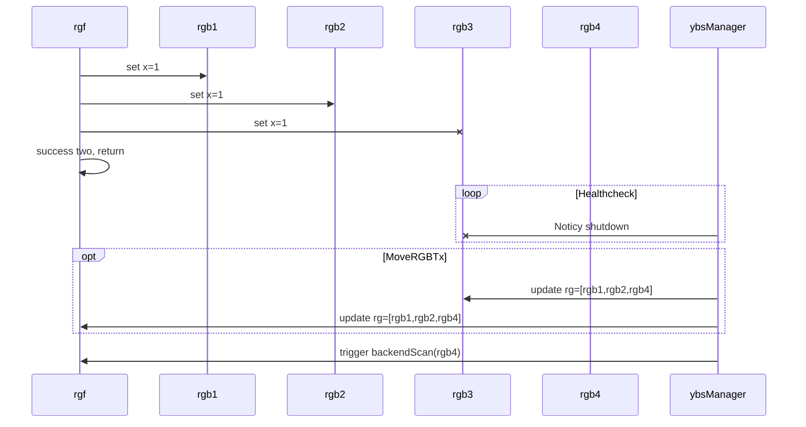
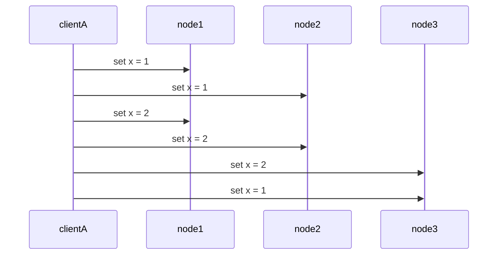
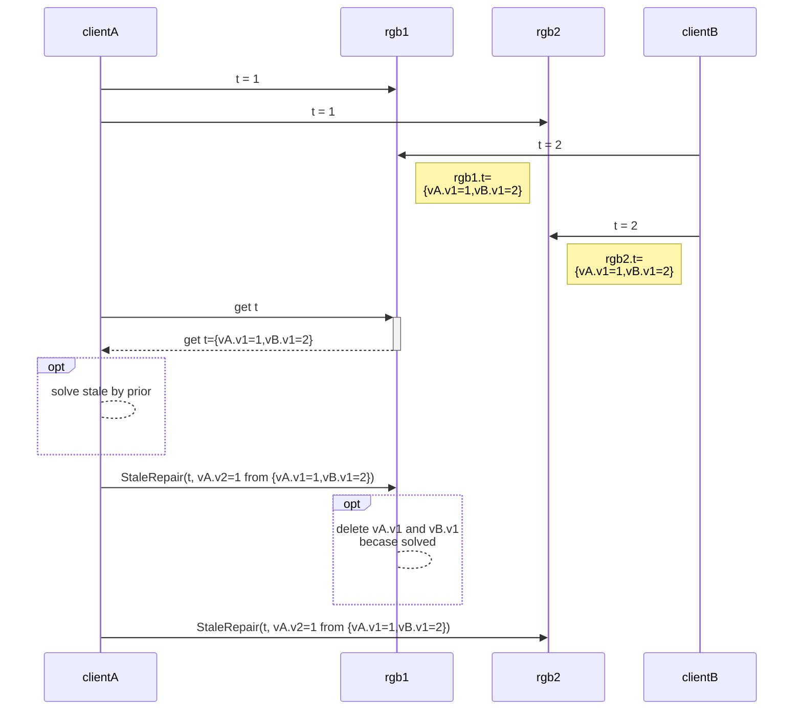
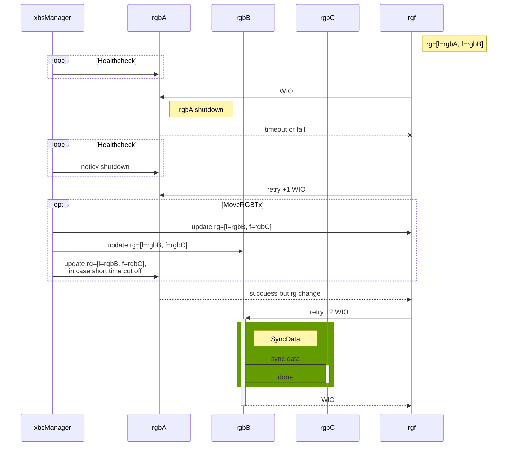

# design Zbs yourself

# Preface

- [design Zbs yourself](#design-zbs-yourself)
- [Preface](#preface)
  - [云硬盘架构设计：如果基于客户端驱动的三副本方案，应该怎么做？](#%e4%ba%91%e7%a1%ac%e7%9b%98%e6%9e%b6%e6%9e%84%e8%ae%be%e8%ae%a1%e5%a6%82%e6%9e%9c%e5%9f%ba%e4%ba%8e%e5%ae%a2%e6%88%b7%e7%ab%af%e9%a9%b1%e5%8a%a8%e7%9a%84%e4%b8%89%e5%89%af%e6%9c%ac%e6%96%b9%e6%a1%88%e5%ba%94%e8%af%a5%e6%80%8e%e4%b9%88%e5%81%9a)
    - [Ybs思路](#ybs%e6%80%9d%e8%b7%af)
    - [Ybs架构](#ybs%e6%9e%b6%e6%9e%84)
    - [Ybs功能](#ybs%e5%8a%9f%e8%83%bd)
      - [Ybs outage / shutdown](#ybs-outage--shutdown)
      - [Ybs concurrent &amp; consistency model](#ybs-concurrent-amp-consistency-model)
      - [Ybs data location analyze &amp; scaling analyze](#ybs-data-location-analyze-amp-scaling-analyze)
      - [Ybs multiple client](#ybs-multiple-client)
      - [Ybs snapshoting](#ybs-snapshoting)
      - [Ybs data hot migration](#ybs-data-hot-migration)
      - [ybs other](#ybs-other)
  - [云硬盘架构设计：如果基于两副本，应该怎么做？](#%e4%ba%91%e7%a1%ac%e7%9b%98%e6%9e%b6%e6%9e%84%e8%ae%be%e8%ae%a1%e5%a6%82%e6%9e%9c%e5%9f%ba%e4%ba%8e%e4%b8%a4%e5%89%af%e6%9c%ac%e5%ba%94%e8%af%a5%e6%80%8e%e4%b9%88%e5%81%9a)
    - [Xbs 思路](#xbs-%e6%80%9d%e8%b7%af)
    - [Xbs架构](#xbs%e6%9e%b6%e6%9e%84)
    - [Xbs功能](#xbs%e5%8a%9f%e8%83%bd)
      - [xbs outage / shutdown](#xbs-outage--shutdown)
      - [xbs concurrent &amp; consistency model](#xbs-concurrent-amp-consistency-model)
      - [xbs data location analyze &amp; scaling analyze](#xbs-data-location-analyze-amp-scaling-analyze)
      - [xbs multiple client](#xbs-multiple-client)
      - [xbs snapshoting](#xbs-snapshoting)
      - [xbs data hot migration](#xbs-data-hot-migration)
      - [xbs other](#xbs-other)

## 云硬盘架构设计：如果基于客户端驱动的三副本方案，应该怎么做？

### Ybs思路

* 可以参考下 DDIA 的“leaderless replication”

[ref](../reading_book_notes/Designing_Data_Intensive_Applications.md)

* Amazon Dynamo

* Quorum write and Quorum read

* compare with raft

good at latency

same at availablity
same at partition tolerent
same at consistency

bad at race conflict

### Ybs架构

(1) ybs-cli

volume = []rgobj

rg= [rgb1, rgb2, rgb3]

(2) rgf

const rgb.page.size = 4KB

rgb.page = {data, version}

rgb = []page

rgf.page = [3]rgb.page

Write(data, rgf.page)

Read(rgf.page) data

(2.1) WriteRGB(data, rgb.page)

(2.2) ReadRGB(rgb.page) (data, version)

(2.3) StaleRepairRGB(data, rgb.page, version)

(2.4) BuildRGB(rgb.page) = ReadRGB + StaleRepairRGB

(3) ybs-storage

ybs-storage = {[]diskopt, []rgb}

(4) rgb

(4.1) WriteRGB(data, rgb.page) = {write data to page; get version from mem; update version}

(4.2) if some IO is error, and data is not atomic writen. anti-entropy will check and RepairData.

(5) diskopt

(5.1) lazy alloc, diskobj pool

(6) ybs-manager

(7) anti-entropy / backend scan (BS)

### Ybs功能

#### Ybs outage / shutdown

(1) Q: rgb fail

(1.1) MoveRGBTx(oldRGB, newRGB, []rgf)

(1.2) BS to recover data of rgb

(2) Q: disk or host fail

(2.1) same as rgb fail * n

(3) Q: In log-state machine, leader has "leader complete", In Quorum, recover data is more hard.

(4) Q: short time cut off

(4.1) if MoveRGBTx then, rgb is recycled

(4.2) if not, rgb is working again

#### Ybs concurrent & consistency model

define "most recent data" with version

eventullay consistency

rgf.page.RWMutex

(1) Q: two writes occur concurrently

(1.1) if allowed, two write can success and one result is silently discard

(1.2) so not allowed

(2) Q: write happens concurrently with read

(2.1) allowed, but read can stale

(3) Q: consistency model ?

(3.1) A: eventually consistency

(4) Q: write happens concurrently with stale-repair

(4.1)  write is more recent compared to stale-repair

(4.2) if allowed, write can be shaded by stale-repair

(4.3) so not allowed

#### Ybs data location analyze & scaling analyze

(1) location

(1.1) []rgb must be located at different host

(1.2) func(Volume) = map\[rg\]rg.page, is loaded by ybs-manager

(1.2.1) a volume should cover as more than 10 rg, for better max-throughput.

(2) scaling

cluster support 3PB * 3

rg = 30K

ybs-storage.size = 12 * 4TB = 48TB

ybs-storage.rgbMap.size = 12 * 4TB / 1 GB = 48K

ybs-storage can serve 10K~ client

ybs-client have max=500TB, avg=(cluster.size * cluster.num / ybs.client.num) volume 

ybs-client.num = 1K

ybs-client.rgMap.size = 50K

ybs-manager need be powerful to maintain rg around 1K ybs-client

volume = volumeStep * N
volumeStep.size = 10GB

(2.1) const rg.size = 1GB, rgobj = 1GB

(2.1.1) benifit is : 
rgf is on (rg.size / rgobj) ybs-client
a volume should cover as more than 10 rg, better throughtput

(2.1.2) badside is : 
when diskdown, you need as many backendScan as x=min(ybs-client.num, ybs-storage.rgbMap.size)

#### Ybs multiple client

(1) multiple client

(1.1) consider nonlinearizable execution

(1.2) proxy to one OR distributed lock

(1.3) version vector? not good, client can't decide which version or there is a prior client.

#### Ybs snapshoting

(1) snapshot-layer beyond rgf

(1.1) read from snapshot(OSS) and StaleRepair and Rebuild(rgb)

#### Ybs data hot migration

(1) migration for rgb, scanner & snapshot & change detector

(1.1) snapshot-layer set snapshot as origin

(1.3) change detector is load beyond rgf, and maintain []rgb.page as changedList

(1.4) scanner read volume, and BuildRGB(volume)

(1.5) scanner get changedList and clean it, then BuildRGB(changeList)

(1.6) once changedList is small enough, stop and build tail part

(2) migration for rg

#### ybs other

## 云硬盘架构设计：如果基于两副本，应该怎么做？

### Xbs 思路

server-side two replica

### Xbs架构

(1) xbs-cli

rg.page = [2]diskpage

vol = []rg.page

(1.1) Q: why vol != rg, A: 1. meaning is not same, rg live longer 2.rg is solid size, vol is varied size

(1.2) in zbs, rg = [3]{diskopt, []pageoff}

(2) rgf

(2.1) WriteRG(data, page, rg.leader)

(2.2) ReadRG(page, rg.leader) data

(2.3) Q: why rg != diskopt? A: 1. meaning is not same 2.if so, if disk breaks, build rg is hard

(3) xbs-storage

(3.1) xbs-storage = {rgarr []rgb, doptarr []diskopt}

(4) rgb

(4.1) rgb-leader handle write, rgb-follower / leader handle read

(4.2) commited is write success, applied is readable

(5) diskopt

(5.1) func(io), diskopt = {optid, diskhardware}

(5.2) lazy alloc, diskobj pool

(6) xbs-manager

(6.1) xbs-manager, XS.append before xbs-manager noticy

### Xbs功能

#### xbs outage / shutdown

(1) Q: disk down?

(1.1) find out tbrgb []rgb, foreach tbrgb {choose XSk; XSk.rgbarr.append(rgb)}

(1.2) datasrc = rgb, datadst = rgbo, copy it. WIO is pending.

(1.3) for rgf, rgb.leader down, RWIO will timeout or fail then retry, until change rgb.leader, WIO is pending.

(2) Q: what if host of xbs down?

(2.1) start XSj at host-j,  find out tbrgb []rgb, do it like (1.1)

(3) Q: xbs-manager down?

(3.1) restart it, IO won't pend

#### xbs concurrent & consistency model

(1) IO concurrent is solved at xbs-storage.rg.leader

#### xbs data location analyze & scaling analyze

(1) Q: vol, rg, disk mapping policy?

#### xbs multiple client

(1) IO concurrent is solved at xbs-storage.rg.leader

#### xbs snapshoting

(1) rgSnap between xbs-storage and rgb.leader

(1.1) rg.page.meta = {version}, snap(VOL0) = [rgi.pagej.versionk, ...]

#### xbs data hot migration

#### xbs other

(1) Q: performance?

(1.1) above diskopt, it's a place to implement redo-log(journal)
