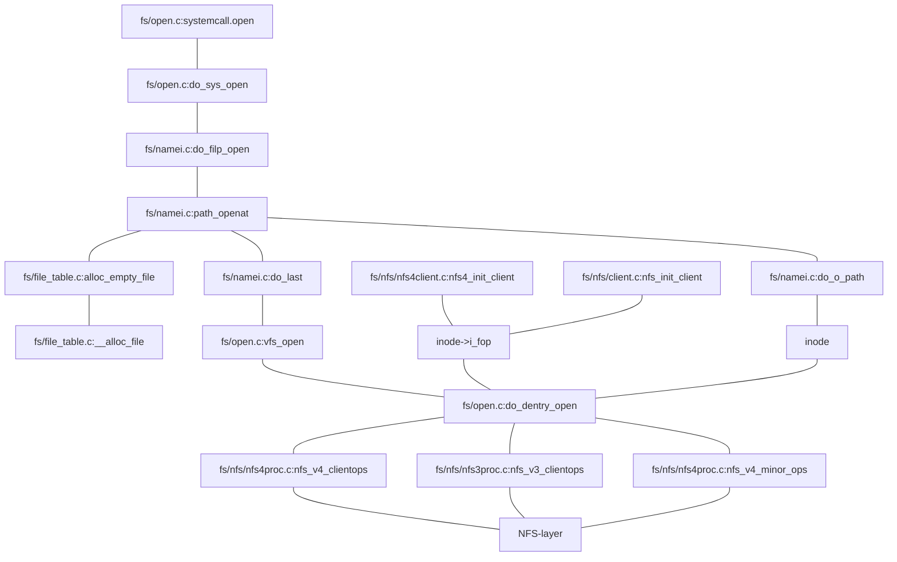
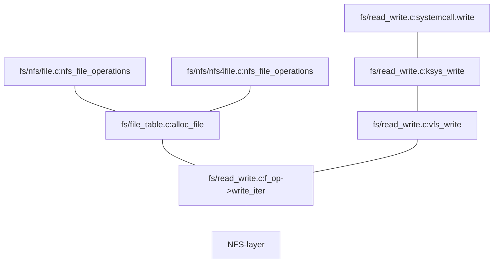
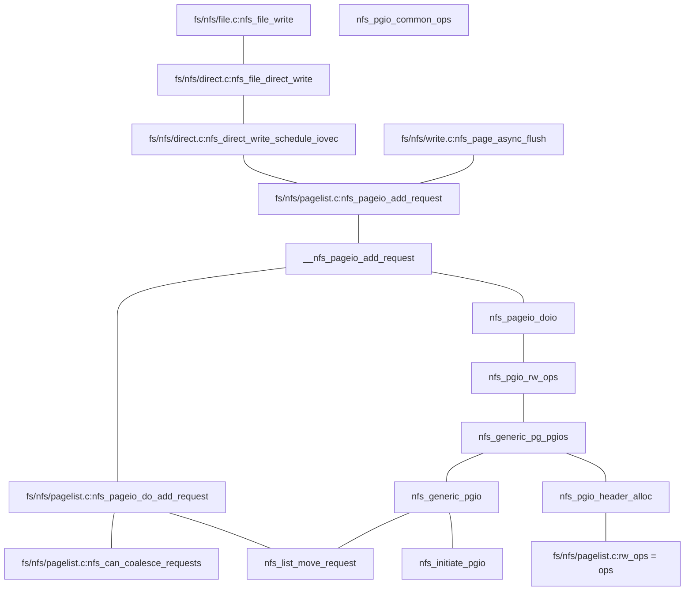

# NFS code path

based on github.com/torvalds/linux:b3a987b0264d3ddbb24293ebff10eddfc472f653

## systemcall 2 NFS-layer

### open systemcall 2 NFS-layer

### write systemcall 2 NFS-layer

## NFS-layer

### NFSv3

### NFSv4

### NFSv4.1

## 引用

1. [systemcall](https://0xax.gitbooks.io/linux-insides/content/SysCall/linux-syscall-5.html)
2. [fs/open.c:systemcall.open](https://github.com/torvalds/linux/blob/2be7d348fe924f0c5583c6a805bd42cecda93104/fs/open.c#L1110)
3. [fs/open.c:do_sys_open](https://github.com/torvalds/linux/blob/2be7d348fe924f0c5583c6a805bd42cecda93104/fs/open.c#L1082)
4. [fs/namei.c:do_filp_open](https://github.com/torvalds/linux/blob/7ada90eb9c7ae4a8eb066f8e9b4d80122f0363db/fs/namei.c#L3559)
5. [fs/namei.c:path_openat](https://github.com/torvalds/linux/blob/7ada90eb9c7ae4a8eb066f8e9b4d80122f0363db/fs/namei.c#L3520)
6. [fs/file_table.c:alloc_empty_file](https://github.com/torvalds/linux/blob/298fb76a5583900a155d387efaf37a8b39e5dea2/fs/file_table.c#L134)
7. [fs/file_table.c:__alloc_file](https://github.com/torvalds/linux/blob/298fb76a5583900a155d387efaf37a8b39e5dea2/fs/file_table.c#L96)
8. [security/security.c:security_file_alloc](https://github.com/torvalds/linux/blob/c2da5bdc66a377f0b82ee959f19f5a6774706b83/security/security.c#L1382)
9. [fs/namei.c:do_last](https://github.com/torvalds/linux/blob/7ada90eb9c7ae4a8eb066f8e9b4d80122f0363db/fs/namei.c#L3264)
10. [fs/open.c:vfs_open](https://github.com/torvalds/linux/blob/2be7d348fe924f0c5583c6a805bd42cecda93104/fs/open.c#L911)
11. [fs/open.c:do_dentry_open](https://github.com/torvalds/linux/blob/2be7d348fe924f0c5583c6a805bd42cecda93104/fs/open.c#L736)
12. [inode->i_fop](https://github.com/torvalds/linux/blob/95207d554b968a552cc93a834af6c1ec295ebaba/fs/nfs/inode.c#L469)
13. [fs/namei.c:do_o_path](https://github.com/torvalds/linux/blob/7ada90eb9c7ae4a8eb066f8e9b4d80122f0363db/fs/namei.c#L3508)
14. [fs/nfs/nfs4client.c:nfs4_init_client](https://github.com/torvalds/linux/blob/95207d554b968a552cc93a834af6c1ec295ebaba/fs/nfs/nfs4client.c#L373)
15. [fs/nfs/client.c:nfs_init_client](https://github.com/torvalds/linux/blob/95207d554b968a552cc93a834af6c1ec295ebaba/fs/nfs/client.c#L634)
16. [fs/nfs/nfs4proc.c:nfs_v4_clientops](https://github.com/torvalds/linux/blob/95207d554b968a552cc93a834af6c1ec295ebaba/fs/nfs/nfs4proc.c#L9996)
17. [fs/nfs/nfs3proc.c:nfs_v3_clientops](https://github.com/torvalds/linux/blob/0576f0602a4926b0027fdd7561a1c0053fa99d26/fs/nfs/nfs3proc.c#L984)
18. [fs/nfs/nfs4proc.c:nfs_v4_minor_ops](https://github.com/torvalds/linux/blob/95207d554b968a552cc93a834af6c1ec295ebaba/fs/nfs/nfs4proc.c#L9944)
19. [fs/read_write.c:systemcall.write](https://github.com/torvalds/linux/blob/2be7d348fe924f0c5583c6a805bd42cecda93104/fs/read_write.c#L620)
20. [fs/read_write.c:ksys_write](https://github.com/torvalds/linux/blob/dd469a456047af5eb1ee0bcfc8fe61f5940ef0e0/fs/read_write.c#L600)
21. [fs/read_write.c:vfs_write](https://github.com/torvalds/linux/blob/dd469a456047af5eb1ee0bcfc8fe61f5940ef0e0/fs/read_write.c#L542)
22. [include/linux/fs.h:file](https://github.com/torvalds/linux/blob/97eeb4d9d755605385fa329da9afa38729f3413c/include/linux/fs.h#L935)
23. [include/linux/fs.h:file_operations](https://github.com/torvalds/linux/blob/97eeb4d9d755605385fa329da9afa38729f3413c/include/linux/fs.h#L1821)
24. [fs/file_table.c:alloc_file](https://github.com/torvalds/linux/blob/298fb76a5583900a155d387efaf37a8b39e5dea2/fs/file_table.c#L188)
25. [fs/nfs/file.c:nfs_file_operations](https://github.com/torvalds/linux/blob/95207d554b968a552cc93a834af6c1ec295ebaba/fs/nfs/file.c#L835)
26. [fs/nfs/nfs4file.c:nfs_file_operations](https://github.com/torvalds/linux/blob/95207d554b968a552cc93a834af6c1ec295ebaba/fs/nfs/nfs4file.c#L405)
27. [fs/read_write.c:f_op->write_iter](https://github.com/torvalds/linux/blob/dd469a456047af5eb1ee0bcfc8fe61f5940ef0e0/fs/read_write.c#L495)
28. [fs/nfs/file.c:nfs_file_write](https://github.com/torvalds/linux/blob/95207d554b968a552cc93a834af6c1ec295ebaba/fs/nfs/file.c#L593)
29. [fs/nfs/io.c:nfs_start_io_write](https://github.com/torvalds/linux/blob/ebc551f2b8f905eca0e25c476c1e5c098cd92103/fs/nfs/io.c#L78)
30. [fs/nfs/direct.c:nfs_file_direct_write](https://github.com/torvalds/linux/blob/1c0cc5f1ae5ee5a6913704c0d75a6e99604ee30a/fs/nfs/direct.c#L955)
31. [fs/nfs/direct.c:nfs_direct_write_schedule_iovec](https://github.com/torvalds/linux/blob/1c0cc5f1ae5ee5a6913704c0d75a6e99604ee30a/fs/nfs/direct.c#L851)
32. [fs/nfs/write.c:nfs_page_async_flush](https://github.com/torvalds/linux/blob/1c0cc5f1ae5ee5a6913704c0d75a6e99604ee30a/fs/nfs/write.c#L606)
33. [fs/nfs/pagelist.c:nfs_pageio_add_request](https://github.com/torvalds/linux/blob/9e8312f5e160ade069e131d54ab8652cf0e86e1a/fs/nfs/pagelist.c#L1165)
34. [fs/nfs/pagelist.c:nfs_pageio_do_add_request](https://github.com/torvalds/linux/blob/9e8312f5e160ade069e131d54ab8652cf0e86e1a/fs/nfs/pagelist.c#L968)
35. [fs/nfs/pagelist.c:nfs_can_coalesce_requests](https://github.com/torvalds/linux/blob/9e8312f5e160ade069e131d54ab8652cf0e86e1a/fs/nfs/pagelist.c#L925)
36. [fs/nfs/pagelist.c:rw_ops = ops](https://github.com/torvalds/linux/blob/9e8312f5e160ade069e131d54ab8652cf0e86e1a/fs/nfs/pagelist.c#L522)