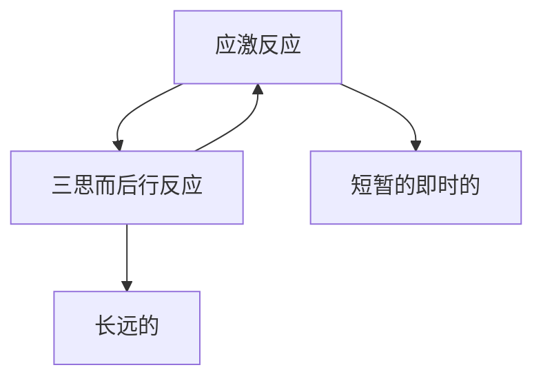

# 自治力读后感

## 第一章 什么是意志力，为什么意志力至关重要?

### 心理

脑千叶,灰质

自治力是我要做，我不要，我想要,三种想法的混合体。

### 生理

心率变化

### 训练自治力

### 冥想

冥想技巧：1. 坐好，不要有冲动，静坐 2. 默念呼和吸，注意呼吸，发现走神后再专注呼吸 3. 感受呼吸，感受怎么走神的，然后感受肉体运动，发现走神后再专注呼吸

冥想时，有分心然后又收回更好。

平时注意什么分散了你的注意力

## 第二章 意志力的本能: 人生来就能抵制蛋糕的诱惑

### 生理提升自治力

#### 睡眠

规律睡觉，或者打个盹

#### 做运动

不停的做你想做的事, 可以是跑步，也可以是做家务

### 自治力太强的代价

长期压力对健康有害，太强的自控也是有害的，会给你过重负担

把自治力用在刀刃上

### 放松对自治力的作用

放松几分钟就能恢复你的身体，并恢复你的自治力储备

生理放松才行，躺下来最好，舒张身体

### 压力对自治力的作用

压力会使人关注即时的结果

学会处理压力有利于增强自治力

## 第三章 累到无力抵抗：为什么自控力和肌肉一样有极限？

### 自控力有极限

自控后需要休息

大脑消耗的能量会减少意志力，吃点糖可以提升短期自治力。

### 自控力锻炼

控制之前不会控制的小事，然后慢慢就控制大事

经常经过糖果罐，但不去吃，也是锻炼

### 大脑的疲惫感

长跑时，大脑产生的疲惫感，但是身体远没有达到极限

疲惫感只是预警

同样的，在第一次疲惫的时候继续，也能冲过意志力的极限

### 只要你想要，就有意志力

如何挖掘“我想要”的力量：

1. 你会怎么样？
2. 你的成功会怎么影响你的朋友，家人
3. 你的生活和事业变成怎么样

意识到,理想和现实差距会给人巨大的压力,专注过程会有利于保持冷静

### 缺乏意志力的原因

1. 很有可能是你太疲惫了(心理，生理)
2. 你总是不使用意志力，所以退化了
3. 最近时间使用太多意志力

1. 最好的方法是，像运动员一样锻炼意志力

## 第四章： 容忍罪恶：为何善行之后会有恶行？

### 做善事，会纵容你做恶事

人们很难驳斥“有些”这个限定词

当我们只需要辨别是否的时候，我们会很容易就做对的决定，然后就放松了警惕从而做出事情。从而变得表里不一。

道德许可效应：那些有道德自我良好的人，会忽视对自己的要求。

### 自我许可的诡异逻辑

只要我们思想里有正反两方，好的行为会使得我们能够做一些坏事，会把坏事当做奖励。

纵容自己就是美德的奖励。

仅仅是考虑好事情，就能产生表扬自己或者放纵自己的想法。

### 善与恶

大部分人，做决定时常用感觉，只有在解释时才会用逻辑。

善是大脑想要的，还是恶才是大脑想要的？

### 锻炼导致多吃

进步被道德化

在某个目标过程中的进步，会导致人民作出坏的行为

### 进步的问题

进步会让我们放弃目标

意志力挑战就是两个自我的冲突，短期和长期的交锋。 然而当我们取得进步时，意志力挑战中短期思维会更强

进步后，关注在进步，则会放纵，关注目标，会继续努力。

### 意志力试验：取消许可，牢记理由

关注对自己的承诺，而不是进步

### 向明天赊账

Ex:麦当劳提供蔬菜沙拉，反而使得“巨无霸”销量增加

Ans:大脑会不理智的把想过的事情当作已经做的成就（意淫？），想过吃沙拉（或者明天吃），所以觉得可以选巨无霸。

明日复明日，明日何其多

### 为什么说，明天总有时间做

总是憧憬着未来，觉得未来能弥补。

### 明天和今天毫无区别

Theory: 当你想改变行为，首先改变行为的变化性

Action: 每天都抽10支烟，会使得你抽的总体烟少。

### 晚饭前的素食主义者

### 当罪恶看上去像美德

Theory：总想说服自己，想要的是好的，以使得放纵的时候没有那么负罪感

### 光环效应

Theory：当我们想放纵自己的时候，会找暗示来为自己辩护,使得坏的东西在好的东西下变得不那么坏。

### 16 神奇词语

零脂肪的巧克力，更让人喜欢吃

### 17

### 18 省钱的念头诱惑了购物者

仅关注了省了多少钱，却没有注意到花了多少钱

理智的确定“metric”，以判断行为是否和你的长远目标相符

### 19 环境的危害

做了环保的事，就开始给自己的“恶”找合理解释

### 20 哪个才是真的你

哪个才是真的你,是追求长期目标的你，还是短期欲望的你

## 第五章 大脑的弥天大谎,为何把渴望当做幸福

### 

Ex: 大脑的某区域，电极刺激，实验对象疯狂渴望

Ans: 这个区域其实是奖励系统的区域，但刺激本身并不会给你满足感

### 03 “我想要”的神经生物学原理

多巴胺，是渴望,我期待

期待好不是的好处，想吃糖不是吃糖的甜味

多巴胺控制的是行动，奖励的承诺。大脑的另一个区域控制快乐。

当多巴胺挟持了你的注意力的时候，你无法考虑别的，大脑就是靠多巴胺，让你不停的打猎和繁殖

进化产生的多巴胺机制和现代世界脱节了，使得它没有那么好

### 04 我们需要多巴胺

我们追寻着，捉摸不着的奖励

电子游戏就是多巴胺的最好利用，会让你的多巴胺神经不停的燃烧

### 05 是什么让你的多巴胺不停燃烧

Doit: 观察是什么让你的多巴胺不停燃烧？

### 06 给上瘾者开的处方

